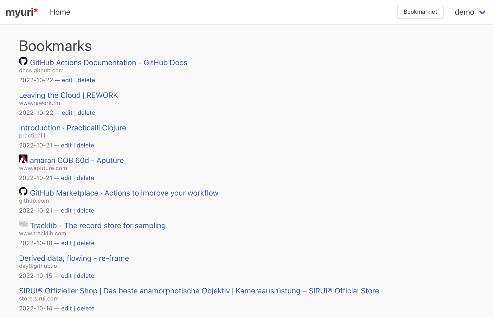

# Myuri
Myuri is a simple bookmark manager.

[](https://github.com/synthomat/myuri/actions/workflows/ci.yml)

It allows bookmarking websites using a convenient bookmarklet.



## Kick Start with Docker-Compose
The most convenient way of starting the software is by using docker-compose
```bash
$ curl -OJ https://raw.githubusercontent.com/synthomat/myuri/main/docker-compose.yml
$ docker-compose up
```
Then open browser at http://localhost:3000/

## Installation
### Prerequisites
* JRE 8+
* Clojure CLI and tools
* PostgreSQL 8+
* Docker and Docker-Compose if you wish to use that stack

Download from https://github.com/synthomat/myuri

## Usage
```bash
$ clj -T:build uber
```

This will produce a self contained uberjar in the `target/` directory.

Run that uberjar:
```bash
$ DATABASE_URL=jdbc:postgresql://localhost/myuri java -jar target/myuri-0.4.jar
```

| Environment   | Default          | Example                           | Explanation                                                                                             |
|---------------|------------------|-----------------------------------|---------------------------------------------------------------------------------------------------------|
| DATABASE_URL  | –                | jdbc:postgresql://localhost/myuri | Database connection string                                                                              |
| COOKIE_SECRET | JS9D2GG6ytgOLx06 | PAWXt2maWB8bpBCR                  | 16-bytes encryption key for the Cookie Session store. **This is critical** – please change the default! |
| PORT          | 3000             | 3000                              | Web App HTTP Port                                                                                       |


Launch with Docker-Compose

```bash
$ docker-compose up
```

Or as daemonized containers (i.e. in background) 
```bash
$ docker-compose up -d
```

## Build Docker image
```bash
$ docker build -t myuri:0.4 .
```

## Dev environment

Launch dev environment in the REPL
```bash
$ DATABASE_URL=jdbc:postgresql://localhost/myuri clj -A:dev
```

Then you can use these commands to launch, restart or stop the running application

```clojure
user=> (go)     ; launches application
user=> (reset)  ; re-starts application
user=> (stop)   ; stops application
```

### Running tests
```bash
$ clj -T:build test
```

## License

Copyright © 2022 Synthomat

Distributed under the ISC License
