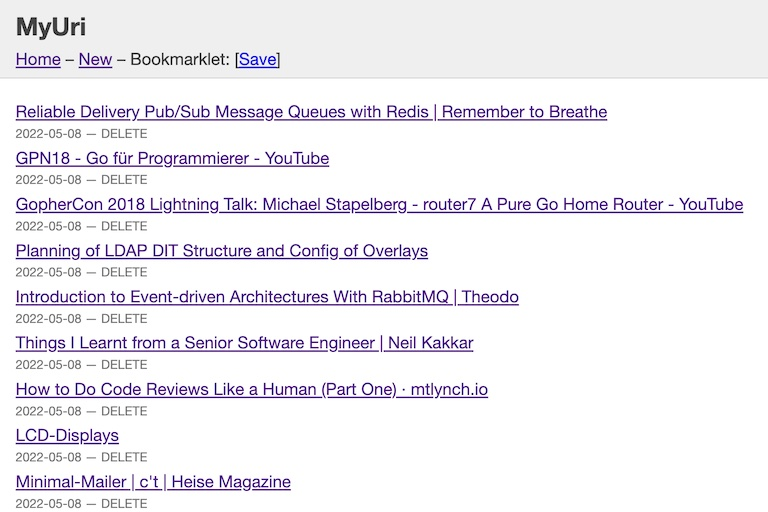

# synthomat/myuri
MyUri is a simple bookmark manager.

It allows adding bookmarks using a convenient bookmarklet.



## Installation
### Prerequisites
* JRE 8+
* Clojure CLI and tools
* PostgreSQL 8+
* Docker and Docker-Compose if you wish to use that stack

Download from https://github.com/synthomat/myuri

## Usage
```bash
$ clj -T:build uber
```

This will produce a self contained uberjar in the `target/` directory.

Run that uberjar:
```bash
$ DATABASE_URL=jdbc:postgresql://localhost/myuri java -jar target/myuri-0.2.jar
```

| Environment  | Default | Example                           | Explanation                |
|--------------|---------|-----------------------------------|----------------------------|
| PORT         | 3000    | 3000                              | Web App HTTP Port          |
| DATABASE_URL | –       | jdbc:postgresql://localhost/myuri | Database connection string |


Launch with Docker-Compose

```bash
$ docker-compose up
```

Or as daemonized containers (i.e. in background) 
```bash
$ docker-compose up -d
```

## Build Docker image
```bash
$ docker build -t myuri:0.2 .
```

## Dev environment

Launch dev environment in the REPL
```bash
$ DATABASE_URL=jdbc:postgresql://localhost/myuri clj -A:dev
```

Then you can use these commands to launch, restart or stop the running application

```clojure
user=> (go)     ; launches application
user=> (reset)  ; re-starts application
user=> (stop)   ; stops application
```

## License

Copyright © 2022 Synthomat

Distributed under the ISC License
